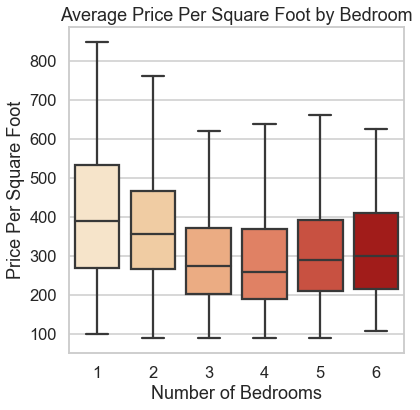
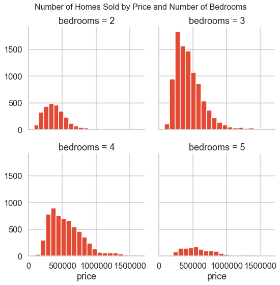
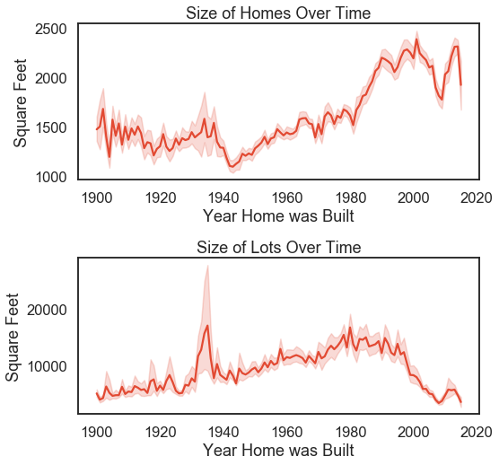
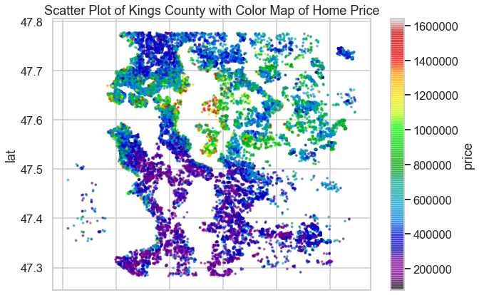
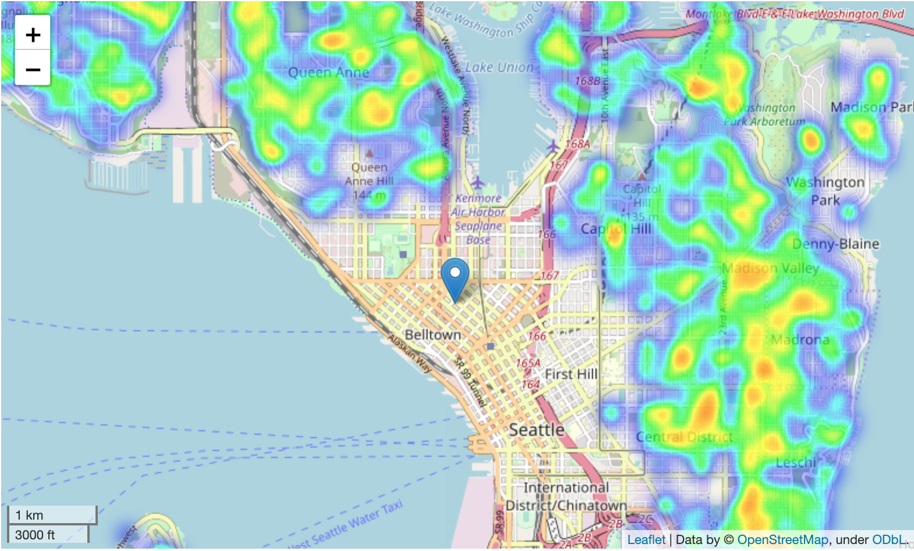
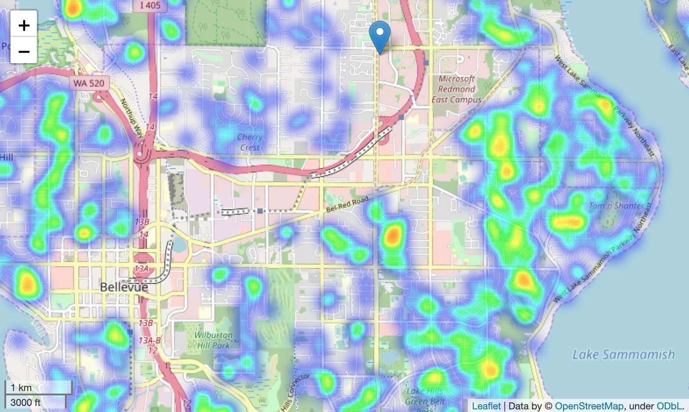

# Modeling House Sales in King County, WA

## Introduction
In this project, I was given a csv dataset for house sales in King County, WA to optimize a multiple linear regression model to predict house sale price. The original dataset contains 21596 rows with 21 columns, which includes home ID (notably not a unique key since a home could be sold more than once in this period), sale date, and price (our target dependent variable.

The libraries I used in Python were:
* pandas for data analysis
* numpy for scientific computation
* matplotlib and seaborn plotting
* statsmodels and sklearn for modelling
* folium, bokeh and pyplot for creating geographic visualizations

## Objective / Questions
In addition to creating several versions of the model, I chose three questions to answer from this dataset, and relied on visualizations to help me explore the data and answer my questions, assuming that this is a database being used by a Real Estate agent I am asking questions that I would consider relevant to a potential homebuyer.

1. Given my budget, how can I anticipate house sale prices and house availability depending on whether I am looking to buy a starter home (2/3 bedrooms) versus a multi-generational home (4+ bedrooms)?
2. What can I expect the square footage of the house and lot to be for a home that is older/newer?
3. In what areas were the highest-value homes sold? Are there areas with a higher density of house sales in this period?

## Data Cleaning 

Before proceeding with the visualizations, I conducted the below steps to ensure that I had a complete dataset. 
* adjusted incorrect datatypes (for ‘date’, from object to datetime and for ‘sqft_basement’, from object to float)
* filled missing values (for ‘waterfront’, ‘view’, and ‘yr_renovated)
* checked for duplicate rows
* dropped multicollinear/un-necessary row (‘sqft_living')
* dropped rows that contained outliers in any variable with a z-score of 3

This left me with 20,064 rows of data, and 18 dependent variables.

## Data Visualization to Answer Questions

### Bedrooms and Price per Square Foot

In order to answer my first question, I created a boxplot in Matplotlib and Seaborn of the price per square foot for each number of bedrooms. As I had removed outliers from this column with a z-score above 3, the highest number of bedrooms in my dataset is 6. 

I created an additional visualization in Seaborn and Matplotlib using a Facet Grid for houses with between 2 and 5 bedrooms to show a histogram of pricing for each # of bedrooms.

### Square Feet of Lots and Houses (Above Ground)

The next visualization in Seaborn and Matplotlib examines how the square feet of homes and their lot sizes changed throughout the decades, based on the Built Year of the home.  

### Mapping Density of Sales and Home Prices

The next set of visualizations aim to illustrate our house sales using longitude and latitude data. 

The first visualization is a pandas scatterplot with a colorbar indicating house sale price.

Next, I worked in Folium to create an interactive map showing density of house sales, with markers indicating the headquarters locations for Amazon and Microsoft. Below are two zoomed in screenshots from Folium.

The last map was created in Bokeh using and similarly to the first map, shows the price of homes binned by color, with a basemap from GoogleMaps.

## Multiple Linear Regression Modelling

### Model 1

My baseline model was created in statsmodels with all of the variables as-is with no modifications to the categorical variables, log transformations or feature scaling. I dropped the columns related to location (latitude/longitude and zipcode), as well as date and yr_built, which based on exploratory visualizations have no bearing on the price. Surprisingly, this baseline model returns an adjusted r-squared of 0.899.

### Model 2

My next model was created in statsmodels. In order to better meet assumptions for linear regression, I one-hot encoded several variables ('sqft_basement', 'view', 'yr_renovated', 'zipcode', 'grade', 'category') and log-transformed/feature scaled the continuous variables ('bedrooms', 'bathrooms', 'floors', 'sqft_above', 'sqft_living15', 'sqft_lot15'). The adjusted r-squared for this model is 0.933, a definite improvement on the prior, and is the best model of thr four I created.

### Model 3

I used Scikit-learn for the third model, breaking my data into a train-test split as well as Recursive Feature Elimination to cut the number of variables in half. This was the least accurate of my four models, and resulted in an adjusted r-squared of 0.749.

### Model 4

Last but not least, I used a Flatiron School-provided function to perform Stepwise selection on my independent variables, with a threshold in of .01 and a threshold out of .05, adding any features with a p-value of the threshold in and working backwards in the model after every added feature to remove features with p-value that exceeds .05. This final model resulted in an adjusted r-squared of 0.930, slightly worse than the second model. 

## Next Steps

I would like to continue working with the geolocation data to better achieve better accuracy of my model, as well as improve the maps in Folium and Bokeh to illustrate the importance of location in determining house price. 

## Conclusion

As my most effective model was the second, it was surprising that neither Stepwise selection nor Recursive Feature Elimination enhanced my model. However, based on the coefficients and p-values for my dataset, the features that were most impactful on house sales are square feet of living space, whether the house was viewed, basement, and renovated. Based on the maps, zipcode and latitude/longitude also have a significant impact on cost.

